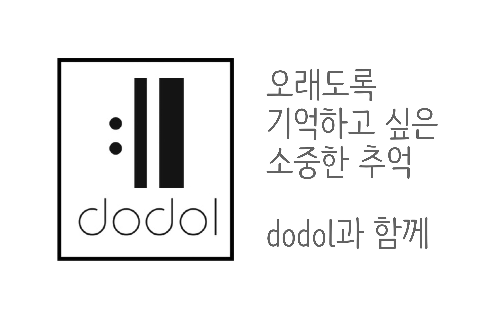
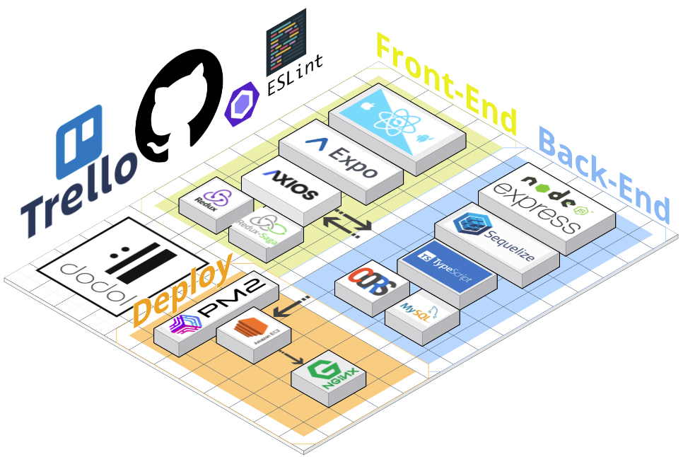

# 💫  DODOL 프로젝트 소개

###  위치기반 타임캡슐 서비스
#### 친구들과 함께 장소를 정해 추억을 담은 타임캡슐을 묻어보세요!

 
 

# 📌 주요 기능
  

위 gif 클릭 시 시연 영상으로 이동 합니다.

- 로그인 : kakao 로그인을 이용해 어플 접근성을 낮춤
- 캡슐 : kakao map api를 이용하여 썸네일, 캡슐오픈 위치 및 날짜, 콜라보레이터 지정 가능
- 메모리 : 캡슐 안에 사진, 글, 음악을 담을 수 있도록 구현
- 캡슐 오픈 : 지정한 날짜와 위치 체크 기능
- 프로필 : 닉네임 변경과 간편한 회원코드 복사 가능

 
 

# 🌴 개발기간 및 팀원소개
## 프로젝트 기간: 2022.05.16. ~ 2022.06.03.(약 3주)

|   이름    |                           깃허브 주소                               | 포지션 |
| :------: | :--------------------------------------------------------------: | :----: |
| 이동훈     |    | 백엔드 💫  &  프론트엔드 |
|  김지현    |        | 프론트엔드 |
|  한빈     |              | 프론트엔드 |

 <a href="https://github.com/green-kong/Dodol-server"> <h3> 👉 Dodol-server Repo 바로가기</h3> </a>
 
 

 # ⏰ WorkFlow
 
 ### 🌱  1st week (프로젝트 시작 전 스터디)
 - 프로젝트 주제를 정하고 구현할 기능/DB schema 설계
 - React Native와 Typescript에 대한 학습 진행
 - 서버 typescript & sequelize 세팅
 ### 🌱 2nd week
 - 서버 작업 완성 (갓동훈)
 - 프로젝트 세팅
 - 메모리 Create, Read 기능 구현
 - 웹뷰를 이용한 kakao 로그인 기능 구현
 - 유저프로필 Read, Update 기능 구현
 ### 🌱 3rd week
 - 캡슐 Create, Read 기능 구현
 - map api를 이용한 위치지정 및 캡슐오픈 기능 구현
 - 전체적인 디자인 및 컨셉 완성
 - 디버깅 및 typescript 에러 수정

 
 

# 🔨 Tech Stack
  

 
 

# <a href="https://github.com/hb707/Dodol-app/wiki"> 👉 Wiki </a>

 
 

 
 

